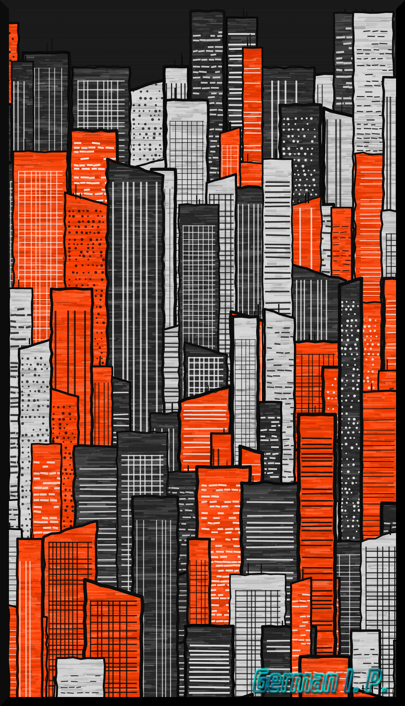

# Orange City (Pollinations AI Edition)


Generador de paisajes urbanos pintados a espátula para **GIMP 3.2**, impulsado por la API de IA de **Pollinations.ai**.

Este plugin combina generación procedimental vectorial en 2D (con Cairo) para siluetas de edificios con texturas de óleo/acristalado y cielos artísticos generados en tiempo real mediante la IA de **Pollinations.ai**.

---

## 🎨 Características

- **Cielos y Fondos Generados por IA**: Conexión nativa con **Pollinations.ai** para generar fondos artísticos basados en prompts en texto.
- **Sin necesidad de API Key**: Utiliza la API pública y gratuita de Pollinations.ai.
- **Texturas de Pintura al Óleo & Espátula**: Renderizado procedimental de edificios con bordes irregulares, ventanales, antenas y trama de lienzo.
- **Resiliencia & Fallback Offline**: Si no hay conexión a Internet o Pollinations no responde, el plugin conmuta automáticamente a un fondo procedimental sin interrumpir tu trabajo.
- **Paleta y Semilla Personalizables**: Control total sobre los colores de la ciudad y fijación de semilla para reproducir resultados.

---

## 🚀 Instalación

1. Copia `orange_city.py` en tu carpeta de plugins de GIMP 3.0 / 3.2:
   - **Linux**: `~/.config/GIMP/3.0/plug-ins/orange_city/orange_city.py` (o en la carpeta configurada en GIMP).
   - **Windows**: `%APPDATA%\GIMP\3.0\plug-ins\orange_city\orange_city.py`
   - **macOS**: `~/Library/Application Support/GIMP/3.0/plug-ins/orange_city/orange_city.py`

2. Asegúrate de otorgar permisos de ejecución (en Linux/macOS):
   ```bash
   chmod +x orange_city.py
   ```

3. Reinicia GIMP.

---

## 🖌️ Uso

En GIMP, crea o abre una imagen y accede desde la barra de menú:

`<Image> -> German Illan Plugins -> Orange City (Pollinations AI)`

### Parámetros Disponibles

- **Color 1**: Color principal de la estructura de edificios.
- **Color 2**: Color secundario para variación de fachadas.
- **Color 3**: Color de acento para detalles.
- **Semilla Aleatoria**: Número para reproducir la misma composición (usa `0` para aleatorio).
- **Usar Fondo Pollinations IA**: Casilla para activar/desactivar la generación de cielo por IA.
- **Prompt Cielo IA**: Texto descriptor para Pollinations (ej: *"dramatic sunset sky watercolor impasto texture"*).

---

## 📄 Licencia y Créditos

Desarrollado por **German Illan** (2026).
Integración de IA powered by [Pollinations.ai](https://pollinations.ai).



